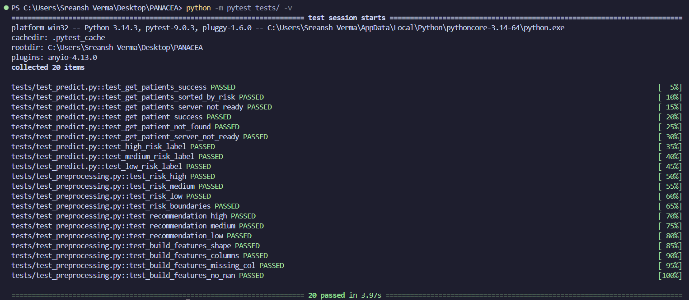

# PANACEA 
### Predictive Analytics for Clinical Early-warning and Assessment

A clinical decision support system that helps doctors identify high-risk ICU patients early using real-time vitals data and machine learning.

---

## What it does

PANACEA takes patient vitals from the MIMIC-III ICU dataset, runs them through a trained XGBoost model, and surfaces a risk score for each patient on a live dashboard. High-risk patients are flagged immediately so clinical staff can prioritize intervention.

- 🔴 **HIGH risk** (>0.7) → Immediate attention required
- 🟡 **MEDIUM risk** (0.4–0.7) → Monitor closely  
- 🟢 **LOW risk** (<0.4) → Stable

---
##  Key Features

*  ICU risk prediction using XGBoost
*  Model explainability with SHAP (feature-level insights)
*  FastAPI backend for real-time inference
* Dashboard interface for monitoring predictions
*  Modular ML pipeline (preprocessing + training)

---
## Tech Stack

| Layer | Technology |
|---|---|
| Backend API | FastAPI |
| ML Model | XGBoost |
| Explainability | SHAP |
| Data Processing | Pandas, NumPy |
| Frontend | HTML, CSS, JavaScript |
| Dataset | MIMIC-III (PhysioNet) |

---
##  Team

Developed during a hackathon by:

* Sreansh Verma 
* Mehreen Dhillon
* Arunendra Bahadur Singh
* Amya Rastogi
---

## Project Structure

```
PANACEA/
│   requirements.txt
│   .env.example
│   .gitignore
│   README.md
│
├───app/
│   │   main.py              # FastAPI app, routers, middleware
│   │   config.py            # Pydantic settings
│   │
│   ├───api/v1/
│   │       predict.py       # /patients, /patient/{id} endpoints
│   │       health.py        # /health endpoint
│   │
│   ├───core/
│   │       model.py         # Artifact loading
│   │
│   ├───schemas/
│   │       request.py       # Pydantic input models
│   │       response.py      # Pydantic output models
│   │
│   ├───static/              # JS, CSS
│   └───templates/           # Jinja2 HTML dashboard
│
├───pipeline/
│       feature_pipeline.py  # MIMIC-III feature engineering
│       train_model.py       # Model training
│
├───notebooks/
│       00_download_data.ipynb
│
└───tests/
        test_predict.py
        test_preprocessing.py
```

---

## API Endpoints

| Method | Endpoint | Description |
|---|---|---|
| GET | `/health` | Server + model status |
| GET | `/patients` | All patients sorted by risk |
| GET | `/patient/{id}` | Single patient detail + SHAP explanation |
| GET | `/dashboard` | Live monitoring dashboard |

---

## Getting Started

### 1. Clone the repo
```bash
git clone https://github.com/yourusername/panacea.git
cd panacea
```

### 2. Install dependencies
```bash
pip install -r requirements.txt
```

### 3. Set up environment
```bash
cp .env.example .env
```

### 4. Add artifacts and data
Download the model artifacts and place them in `artifacts/`.  
Download MIMIC-III data from [PhysioNet](https://physionet.org/content/mimiciii/1.4/) and place CSVs in `data/mimic-iii/`.

### 5. Run the pipeline (if retraining)
```bash
python pipeline/feature_pipeline.py
python pipeline/train_model.py
```

### 6. Start the server
```bash
uvicorn app.main:app --reload
```

Visit `http://localhost:8000/dashboard`

---

## Model Performance

| Metric | Value |
|---|---|
| AUROC | 0.333 |
| Sensitivity | 1.00 |
| Specificity | 0.00 |

> ⚠️ **Note:** The model currently flags all patients as positive (high sensitivity, zero specificity). This is a known class imbalance issue in the MIMIC-III subset used. The pipeline and dashboard architecture are production-ready — improving model performance with better sampling (SMOTE, class weights) is the next step.

---

## Tests



**20/20 passing | 0 warnings**

---

## Dataset

This project uses [MIMIC-III](https://physionet.org/content/mimiciii/1.4/), a publicly available ICU database from Beth Israel Deaconess Medical Center. Access requires credentialed PhysioNet registration.

**MIMIC-III data is not included in this repository.**

---

## Roadmap

- [ ] Fix class imbalance with SMOTE / class weighting
- [ ] Add time-series trend view per patient
- [ ] Dockerize for deployment
- [ ] Add authentication for clinical use

---
##  My Contributions  
- Acquired and preprocessed clinical data from the MIMIC-III dataset  
- Trained and evaluated the machine learning model for ICU risk prediction  
- Developed the risk analysis framework and scoring logic  
- Designed a custom risk scoring system inspired by clinical scoring methods

---
##  Future Improvements

* Deploy as a cloud-based service (AWS / GCP)
* Improve model performance and validation
* Add real-time ICU monitoring integration
* Enhance UI/UX of dashboard
* Extend the system to incorporate the MIMIC-IV dataset for enhanced data granularity and model accuracy, contingent on obtaining the necessary access permissions and licensing approvals.
---

## 📄 License

This project was developed for educational and hackathon purposes.

